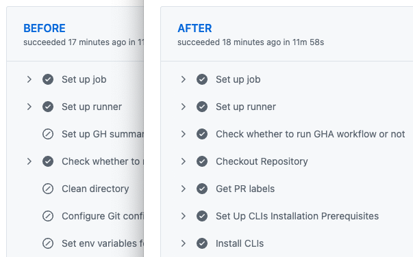
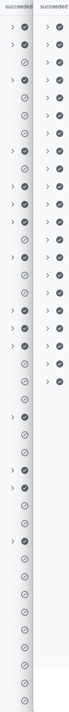

# GitHub Hide Skipped Jobs Userscript

A userscript to automatically hide skipped jobs from GitHub Actions workflow runs.

❓ Do you have workflows that have a lot of skipped jobs, taking up precious vertical screen real estate?

❓ Do you want the skipped jobs in GitHub Actions workflow runs to be hidden by default when you load the page?

<b>Then this userscript is for you!</b>

<i>(click to see an example of how much vertical real estate could be saved)</i>

## Motivation

The creation of this userscript comes from my personal frustrations, and a 'push' from the community who is also interested in this capability; specifically, [this GitHub community discussion](https://github.com/orgs/community/discussions/18001#discussioncomment-14675538).

## Installation

**Prerequisites:** You will need an userscript manager installed on the browser you view GitHub Actions workflow runs on. [Tampermonkey](https://www.tampermonkey.net/) (no affiliation) is a common userscript manager.

Click here for browser-specific extension links for Tampermonkey

- [Chrome](https://chrome.google.com/webstore/detail/tampermonkey/dhdgffkkebhmkfjojejmpbldmpobfkfo)
- [Firefox](https://addons.mozilla.org/en-US/firefox/addon/tampermonkey/)
- [Safari](https://apps.apple.com/app/apple-store/id1482490089)
- [Microsoft Edge](https://microsoftedge.microsoft.com/addons/detail/tampermonkey/iikmkjmpaadaobahmlepeloendndfphd)
- [Opera](https://addons.opera.com/en/extensions/details/tampermonkey-beta/)

### [Click here to install](https://raw.githubusercontent.com/ChrisCarini/github-hide-skipped-jobs-steps-userscript/main/GitHub-Hide-Skipped-Jobs-Steps.user.js)

_(**Note:** Your userscript manager should prompt you to install this userscript.)_

## Support / Contributions

Need support with the userscript? Feel free to open an issue on this repository.

Have a contribution _(fix/improvement/etc)_ you would like to share? PRs are welcome!
